Based on the file names visible in your first screenshot and the folder structure in your second screenshot, I have updated the `README.md`.

I have organized the screenshots by user role (Admin, Instructor, Student) to match your features section. I used the exact folder name `Screenshots/` (with a capital "S") as shown in your GitHub file tree.

Here is the complete code. You can replace your entire current file with this:

```markdown
# University ERP System

**Authors:**
* **Somya** (Roll No: 2024560)
* **Arjun Khatri** (Roll No: 2024106)

## 📖 Project Overview
The **University ERP System** is a robust desktop application developed using **Java and Swing**, designed to digitize and streamline academic operations. The system manages the core lifecycle of academic administration, including user management, course cataloging, section allotment, student enrollment, and grade computation.

The project features a **Role-Based Access Control (RBAC)** system with three distinct dashboards (Admin, Instructor, Student) and implements a unique **Dual-Database Architecture** to separate sensitive authentication data from general ERP records.

---

## 📸 Screenshots

### 🔐 Authentication
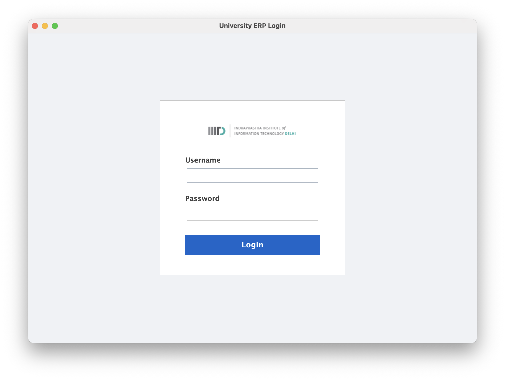

### 🛠 Admin Module
| Dashboard | User Management |
| :---: | :---: |
| 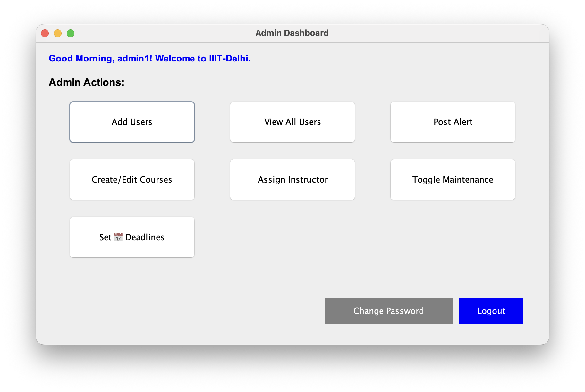 | 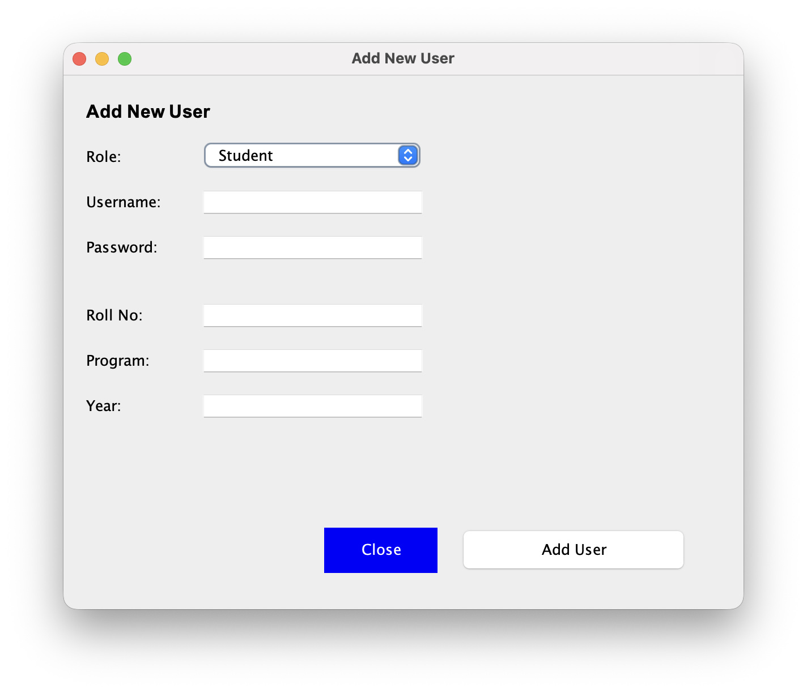 |

| Course Mgmt | Section Allotment | Deadlines |
| :---: | :---: | :---: |
| 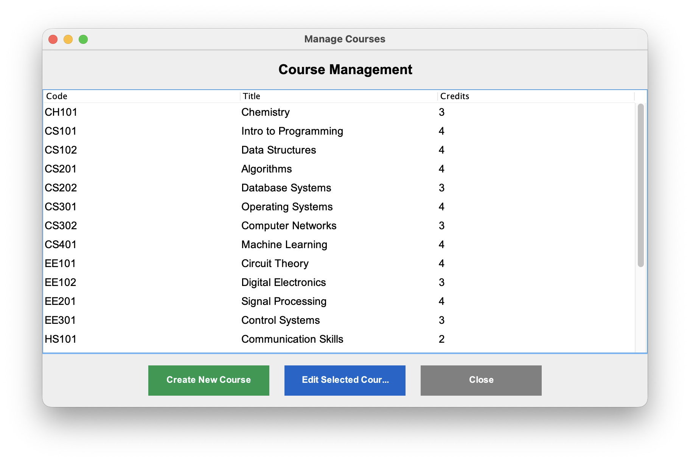 | 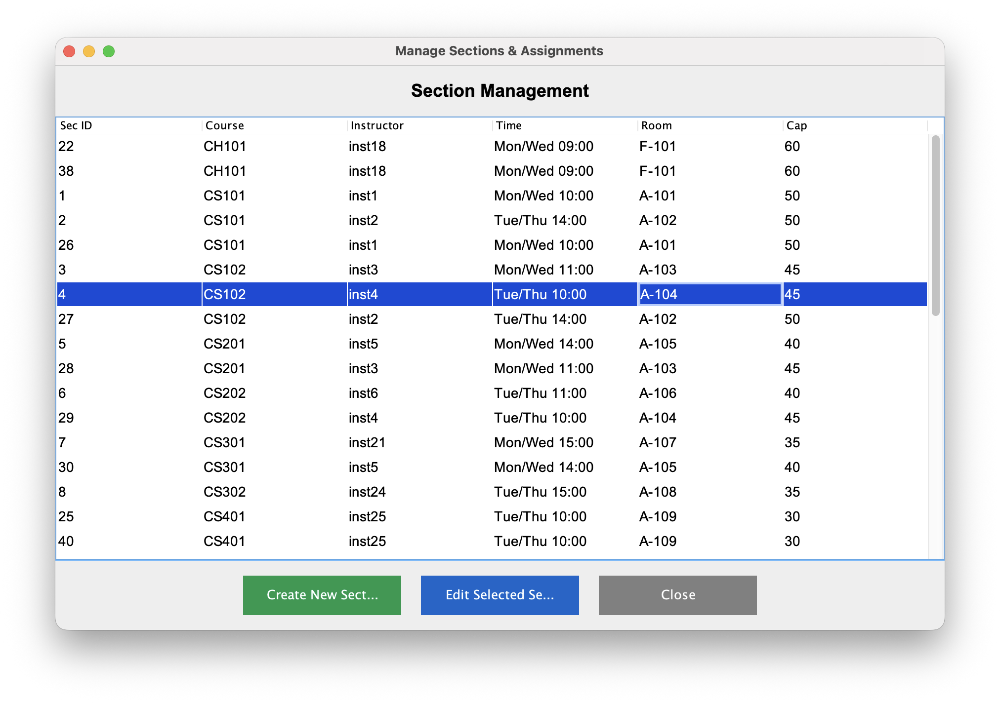 | 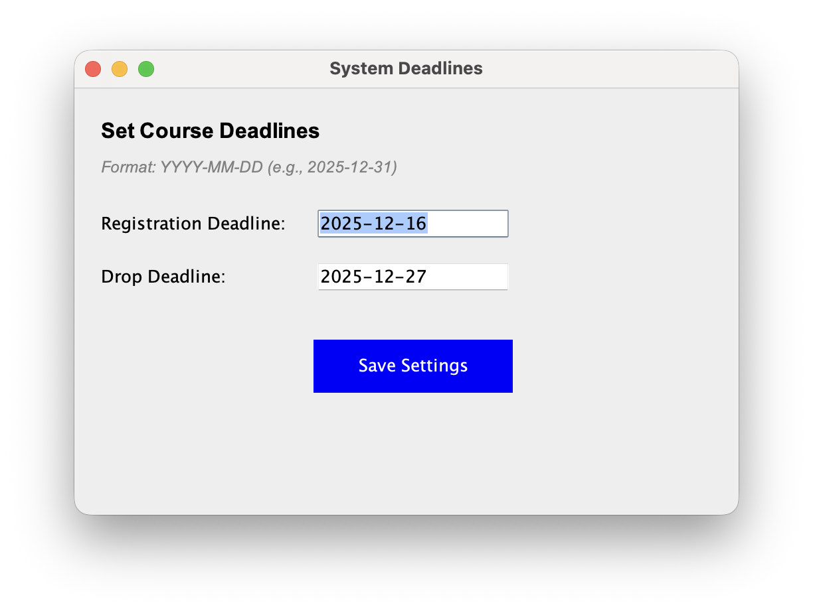 |

### 🎓 Instructor Module
| Dashboard | Grading | Statistics |
| :---: | :---: | :---: |
|  | 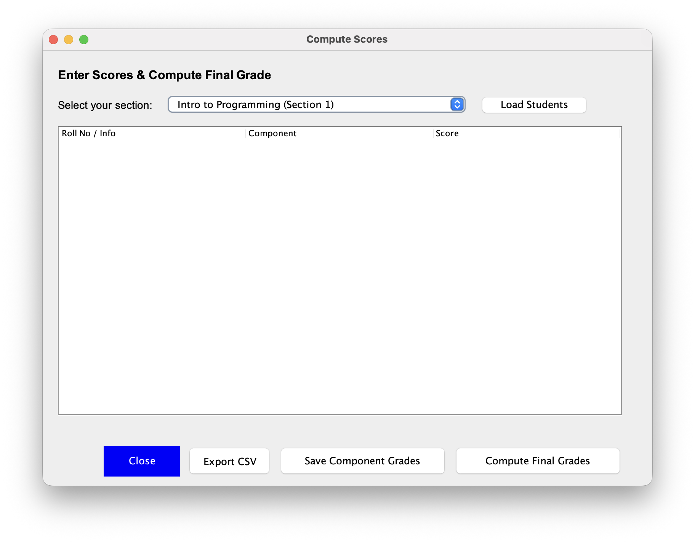 | 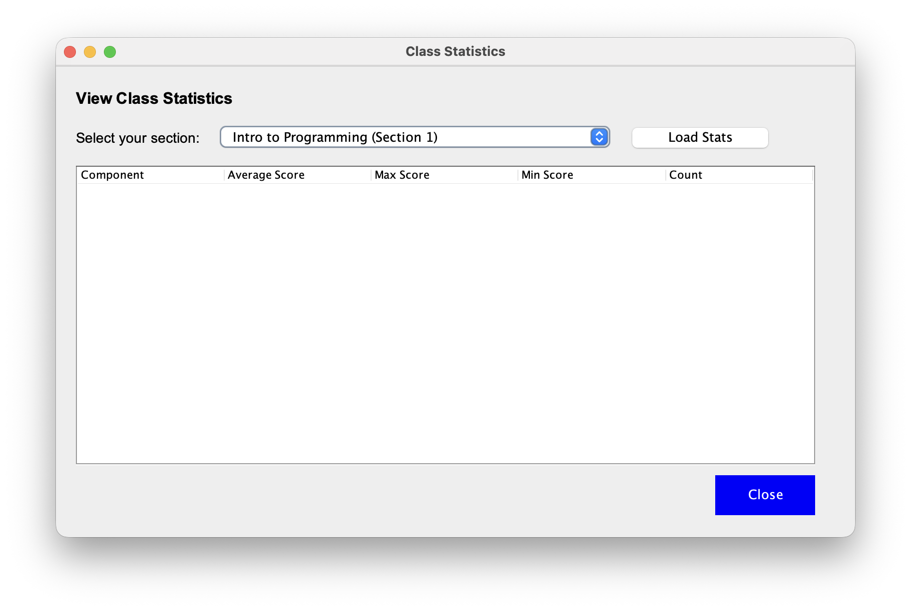 |

### 📚 Student Module
| Dashboard | Course Catalog | Drop Course |
| :---: | :---: | :---: |
| 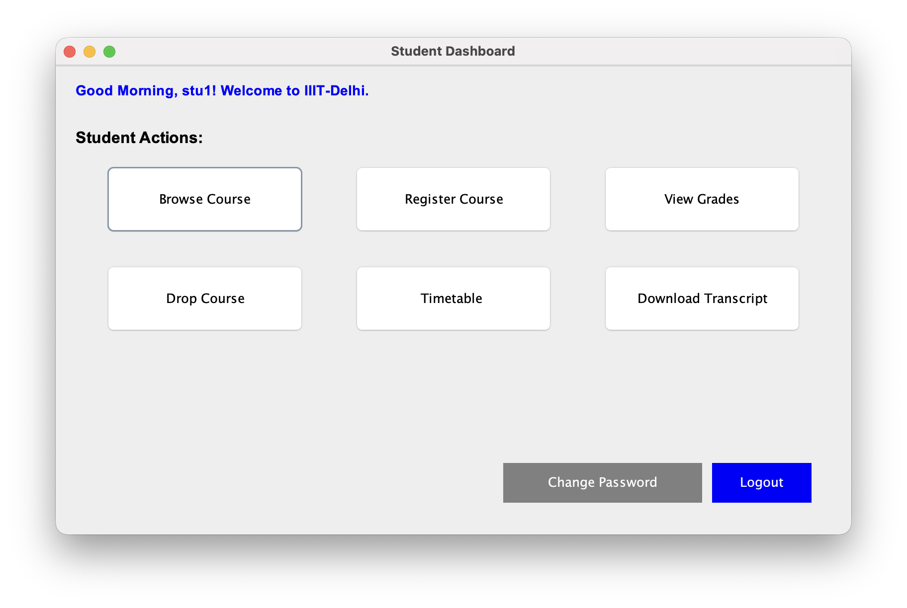 | 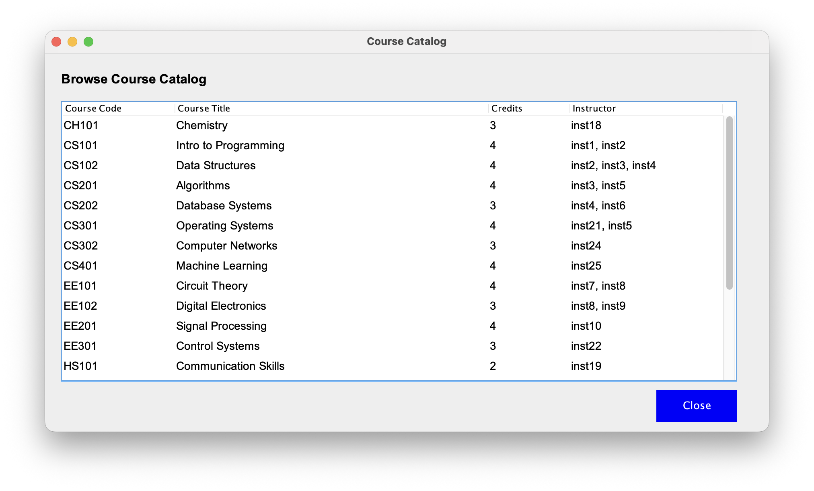 | 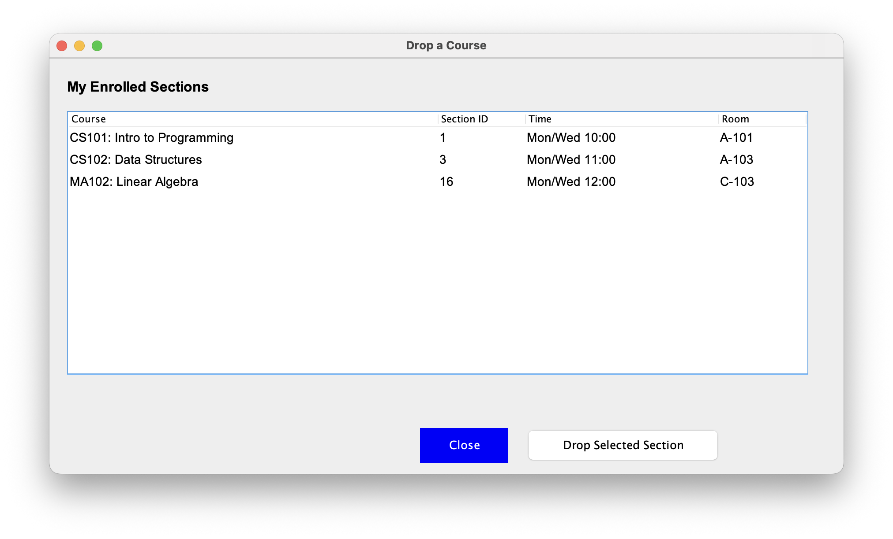 |

| Timetable | Transcripts/Grades |
| :---: | :---: |
| 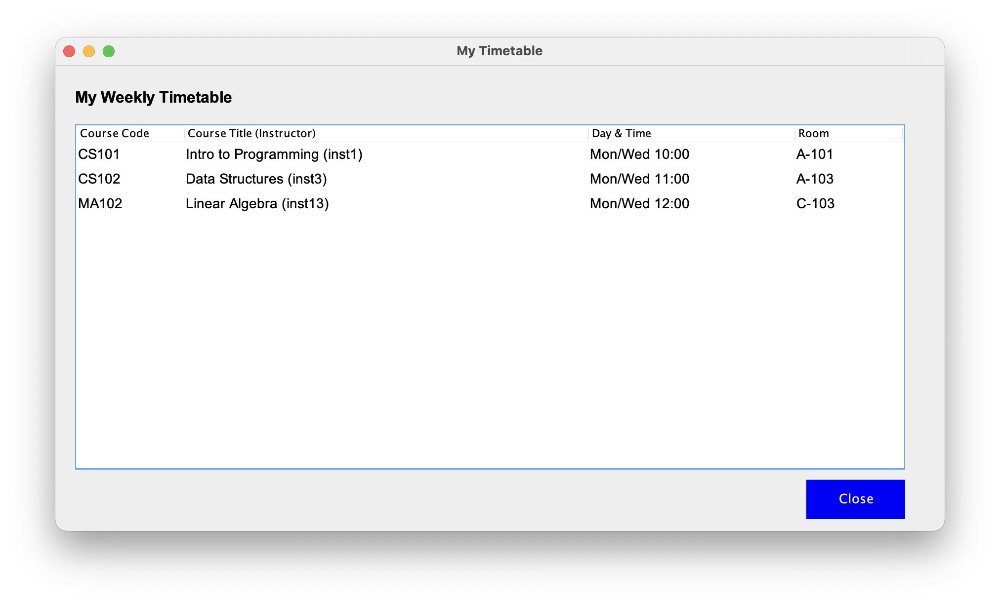 | 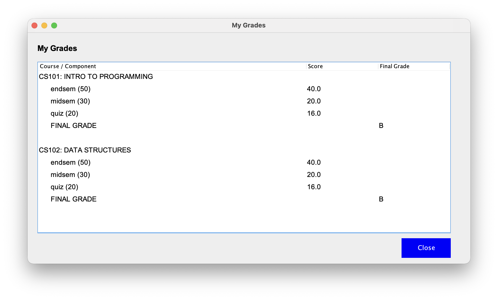 |

---

## 🚀 Key Features

### 🔐 Security & Architecture
* **Dual-Database Design:** Strict separation of concerns using `auth_db` (credentials) and `erp_db` (academic data).
* **Secure Authentication:** Passwords are hashed using **BCrypt**; no plain text storage.
* **Account Lockout:** Automatic account locking after 3 consecutive failed login attempts.
* **SQL Injection Protection:** All database interactions utilize `PreparedStatement`.

### 🛠 Administrative Modules
* **User Management:** Create and manage Students, Instructors, and Admins.
* **Course Management:** Create courses and assign sections to instructors.
* **Maintenance Mode:** A global "Kill Switch" that pauses all write operations (registrations/grading) while keeping the system read-only.
* **Deadline Enforcement:** Set strict Registration and Drop deadlines.

### 🎓 Academic Modules
* **Student Dashboard:**
    * Browse Course Catalog.
    * Register/Drop courses (with capacity and deadline checks).
    * View Grades and download Transcripts (CSV).
    * View Weekly Timetable.
* **Instructor Dashboard:**
    * View assigned sections.
    * **Dynamic Grading:** Enter scores for Quiz (20), Midsem (30), and Endsem (50).
    * **Auto-Computation:** System automatically calculates totals and assigns Letter Grades (A/B/C/D/F).
    * **View Class Statistics:** (Max, Min, Avg scores).

---

## 💻 Technology Stack

* **Language:** Java (JDK 21+)
* **UI Framework:** Java Swing (GridBagLayout, Custom layouts)
* **Database:** MySQL 8.0
* **Dependencies:**
    * `mysql-connector-j` (JDBC Connectivity)
    * `jbcrypt` (Password Hashing)
    * `opencsv` (Report Generation)

---

## ⚙️ Installation & Setup

### Prerequisites
* Java Development Kit (JDK) 21 or higher.
* MySQL Server running on `localhost:3306`.
* An IDE (IntelliJ IDEA or Eclipse).

### Database Configuration
The system requires specific SQL scripts to be run in a precise order. These are located in the `database/` folder.

1.  **Open your MySQL Workbench/Terminal.**
2.  **Run `db_schema.sql` FIRST:** This creates the `auth_db` and `erp_db` schemas and all table structures.
3.  **Run Seed Data (Choose ONE):**
    * Run `short_seed_data.sql`: Recommended for quick testing (Contains 1 Admin, 1 Instructor, 2 Students).
    * **OR**
    * Run `long_seed_data.sql`: Use for load testing (Contains 100+ users).

### Application Configuration
Navigate to `src/main/java/com/erp/database/DatabaseConnector.java` (or equivalent path in your source) and update your MySQL credentials:

```java
private static final String DB_USER = "root";
private static final String DB_PASSWORD = "YOUR_MYSQL_PASSWORD";

```

```

```
